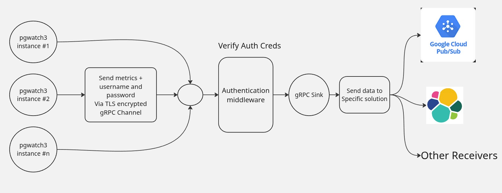

# Pgwatch RPC Sinks



## Intro

A **community-maintained** collection of gRPC sink implementations for pgwatch.

This provides sinks for common data solutions but makes no guarantees about their suitability for real production use.  

Our main purpose is to provide examples and building blocks that users can extend to integrate with pgwatch and develop their own production-ready gRPC servers.

Check out <a href="https://github.com/cybertec-postgresql/pgwatch">PgWatch</a> to get started with this project.

## Running Sinks

If you are using pgwatch's gRPC client sink with 
authentication credentials or TLS configured, you'll 
need to set the following environment variables 
to ensure the server works properly.

```
# if empty, password is ignored during authentication
export PGWATCH_RPC_SERVER_USERNAME="username"

# if empty, username is ignored during authentication
export PGWATCH_RPC_SERVER_PASSWORD="password"

# if not set, TLS is not used
export PGWATCH_RPC_SERVER_CERT="/path/to/server.crt"

# if not set, TLS is not used
export PGWATCH_RPC_SERVER_KEY="/path/to/server.key"
```

To start any of the provided receivers, you can use:
```bash
# generate golang code from protobuf 
go generate ./sinks/pb
go run ./cmd/[receiver_dir] [OPTIONS]

# OR

# generate python gRPC code from protobuf
python3 -m grpc_tools.protoc -I sinks/pb --python_out=cmd/pyiceberg_receiver --grpc_python_out=cmd/pyiceberg_receiver sinks/pb/pgwatch.proto
python3 ./cmd/[receiver_dir] [OPTIONS]
```
By default, all sinks will listen at `0.0.0.0` with the specified port number.

Now once your receiver is up, run pgwatch with the argument: 
`--sink=grpc://<sink_ip/hostname>:<sink-port> [OPTIONS]`

Voila! You have seamless integration between pgwatch and your custom sink.   

## Developing Custom Sinks

To get started with developing your own custom sinks, refer to this mini [tutorial](TUTORIAL.md).

You can also look at our [example sinks](./cmd/) to help with your implementation or extend them for your own use cases.

## Credits

[Akshat Jaimini](https://github.com/destrex271)  
[Ahmed Gouda](https://github.com/0xgouda)